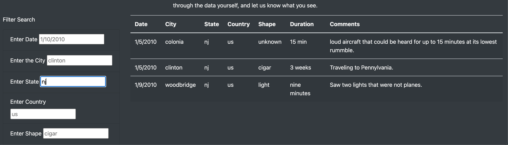

# UFOs
## Overview
To help Dana create a more in-depth analysis of UFO sightings by allowing users to filter for multiple criteria at the same time. This was accomplished by adding a filter for city, state, country and shape.

## Results: 
Visitors to the website will now be able to search the database by multiple criteria(city,state,country, and shape).  This will allow users to quickly filter down to the specific information for which they are looking.
Prior to this change, users had to to a page search to find their desired information.
In the image below, NJ was input as the state and three results were displayed.

## Summary
A limit and a suggestion for future development of the website would be to link to more recent data.  At this time, the available data in the dataset is a decade old.  Another suggestion would be to include a way for pictures to be displayed if available from the specific account.
